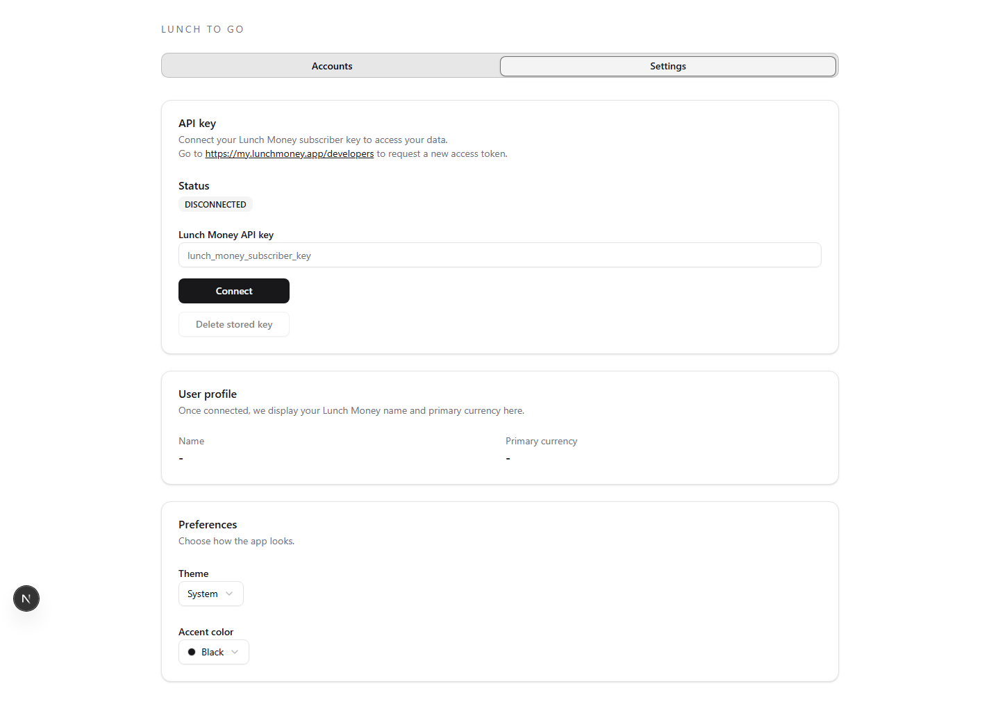
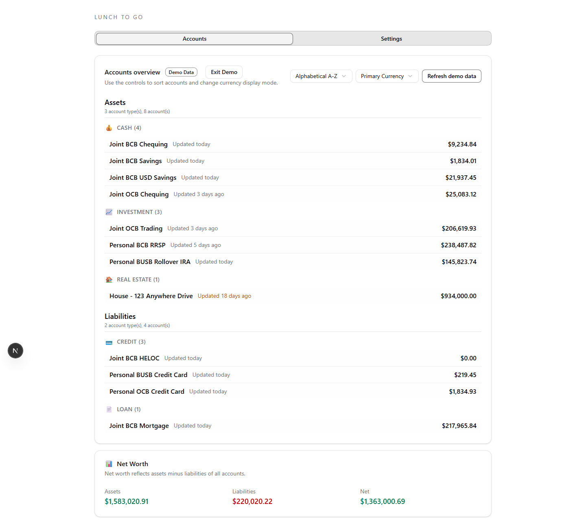

# Lunch To Go

Lunch To Go is a Next.js + Tauri companion for Lunch Money subscribers. It delivers a sortable account overview, a polished settings surface, and a Windows desktop shell while sharing a single React codebase.

## Agentic Coding Project Experiment

Other than requirements `docs\Lunch_To_Go_Requirements.md`, demo data `app\public\demo_accounts_data.csv` and this section in `README.md` which were hand-crafted, this entire project is created using agentic AI tools. Human intervention and guideance were used to clarify and tweak a few things along the way but it's otherwise 100% machine created.

Open AI Codex for spec, plan, tasks, coverage matrix, then a mix of Codex, Copilot and Claude for the implementation based on what credits were available for the month.

This is the second attempt.  The first used Dart and Flutter, while that worked it was over engineered. This version put more bounds and focus on precise requirements, and changed technology stack to be a more popular one with the idea that AI would have an easier time of it creating the end product, and to flex the idea that the tech doesn't really matter as long as you meet the requirements success criteria.

## Contents

- [Lunch To Go](#lunch-to-go)
  - [Agentic Coding Project Experiment](#agentic-coding-project-experiment)
  - [Contents](#contents)
  - [Highlights](#highlights)
  - [Screenshots](#screenshots)
  - [Project Layout](#project-layout)
  - [Quick Start (Web)](#quick-start-web)
  - [Quick Start (Desktop)](#quick-start-desktop)
  - [Quality \& Tooling](#quality--tooling)
  - [Lunch Money References](#lunch-money-references)
  - [Refreshing Documentation Screenshots](#refreshing-documentation-screenshots)

## Highlights

- Dual-target delivery: browser build (Next.js 16 (beta) / React 19) and Windows desktop app (Tauri 2 + WebView2).
- Fully typed data client with TanStack Query caching, Zustand preference hydration, and secure key storage adapters.
- Demo data mode for showcasing features without a Lunch Money API token.
- Accessibility-first UI using Shadcn primitives, Tailwind tokens, and automated axe/Playwright coverage.

## Screenshots


_Settings tab with API key management and theming controls._


_Accounts tab using bundled demo data, including grouping, currency toggles, and net worth._

## Project Layout

- `app/` – Next.js application, Shadcn components, TanStack Query state, Playwright + Vitest suites.
- `src-tauri/` – Tauri shell, secure credential commands, and Windows packaging config.
- `scripts/` – PowerShell helpers for linting, testing, builds, packaging, smoke tests, and docs refresh.
- `docs/` – Requirements, release/process docs, screenshots, and security notes.
- `specs/` – Living spec, implementation plan, task tracker, and coverage matrix.

## Quick Start (Web)

```powershell
cd app
corepack pnpm install
corepack pnpm dev -- --hostname 127.0.0.1 --port 3000
```

1. Navigate to `http://127.0.0.1:3000`.
2. Create or paste a Lunch Money API key under **Settings -> API key management** and connect.
3. Switch to the **Accounts** tab for live balances, or use **Show Demo Data** to explore mock content offline.

Useful scripts:

- `corepack pnpm lint` – ESLint (with custom rules and Tailwind plugin).
- `corepack pnpm test` – Vitest unit suite with coverage.
- `corepack pnpm e2e` – Playwright end-to-end checks (web + WebView2 profiles).
- `corepack pnpm build` / `corepack pnpm start` - Production bundle + runtime server.

## Quick Start (Desktop)

```powershell
# From repo root
pwsh -File scripts\build-web.ps1
pwsh -File scripts\package-desktop.ps1
```

Outputs:

- Release installer: `dist\Lunch To Go_0.1.0_x64-setup.exe`
- Debug installer: `dist\Lunch To Go (Debug)_0.1.0_x64-setup.exe`

After installing, the desktop shell mirrors the web UI and persists Lunch Money credentials via the Windows Credential Locker bridge implemented in `src-tauri`.

For local iteration use:

```powershell
pwsh -File scripts\run_web.ps1            # Next.js dev server with logging helpers
cd src-tauri
cargo tauri dev                          # Desktop shell pointed at the dev server
```

## Quality & Tooling

- Manual CI run book: `docs/manual-cicd-runbook.md`
- Release notes & install guidance: `docs/release-notes.md`, `docs/desktop-installation.md`
- Accessibility & performance: Playwright (`tests/e2e`), axe scans, Lighthouse/WebView2 perf budgets.
- Security posture: `docs/security-review.md` plus OWASP/CVE checks invoked from `scripts`.
- GitHub publication walk-through: `docs/github-release.md` + `scripts/publish-github.ps1`

## Lunch Money References

- Official API docs: <https://lunchmoney.dev/>
- Developer portal for API keys: <https://my.lunchmoney.app/developers>
- Lunch Money web app: <https://my.lunchmoney.app/>
- This project's requirements mapping: `docs/Lunch_To_Go_Requirements.md`

## Refreshing Documentation Screenshots

Screenshots live in `docs/images/` and are generated with Playwright to ensure consistent framing.

```powershell
cd app
$env:CAPTURE_SCREENSHOTS = "1"
corepack pnpm exec playwright test tests/e2e/doc-screenshots.spec.ts --project web-chromium
Remove-Item Env:CAPTURE_SCREENSHOTS
```

The helper spec (`tests/e2e/doc-screenshots.spec.ts`) spins up the dev server, toggles demo data, and saves `settings-view.png` and `accounts-view.png`.
